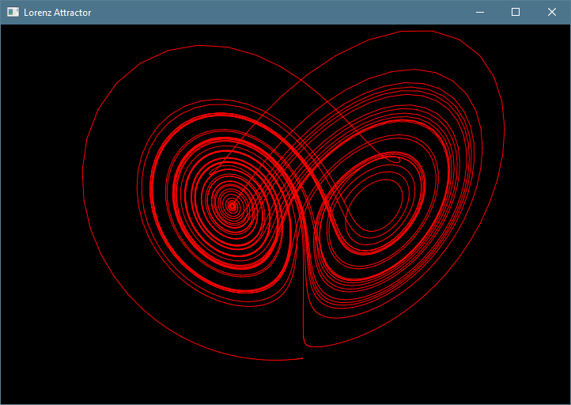

# lorenz
3D Lorenz Attractor



A small fun project I made to render out a Lorenz Attractor, commonly associated with the butterfly effect. 
You can alter the code to run multiple attractors at once with various length limits. If you would like to implement your own strange attractor with this application, feel free to submit a pull request!

# Installation and Execution

```bash
python3 -m pip install -r requirements.txt
python3 main.py
```


